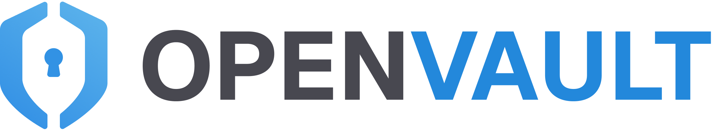
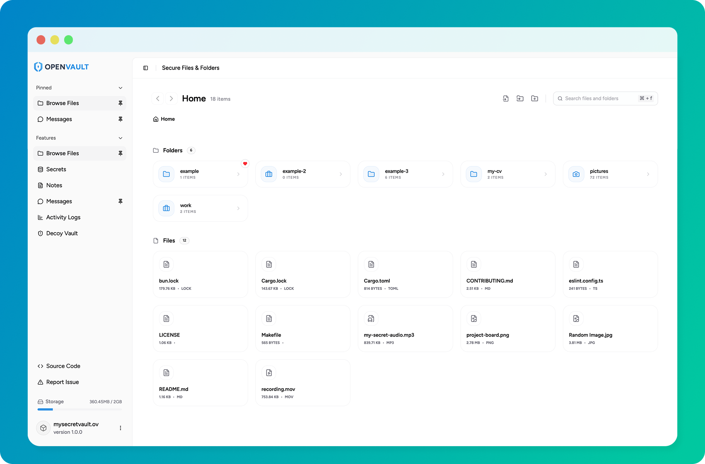

<p align="center" style="border-bottom: none">
  <picture>
    <source media="(prefers-color-scheme: dark)" srcset="./docs/openvault-logo-light.png">
    
  </picture>
</p>

<p align="center">
  <strong>✨ Start Securing Your Digital Life ✨</strong>
</p>

<p align="center">
  
  
  
  
</p>

<br />

<div align="center">
  
</div>

<br />

OpenVault is a secure, open-source vault application focused on strong cryptography, performance, and simplicity. It combines Rust’s memory-safe backend with modern frontend technologies to deliver a fast, reliable, and cross-platform desktop experience.

## ✨ Features

OpenVault provides a collection of secure tools designed to protect your data.

All information stored in the vault is encrypted to ensure privacy and security.

- ✅ **File & Folder Encryption** — Securely store and protect files and directories using strong encryption.
- ⚠️ **End-to-End Encrypted (Offline) Messaging** — Send and receive private messages that remain encrypted and accessible even without an internet connection.
- ⚠️ **Password Manager** — Safely store, organize, and manage passwords and sensitive credentials.
- ⚠️ **Encrypted Notes** — Create and store private notes with full encryption.
- ⚠️ **Encrypted To-Do List** — Manage tasks and reminders while keeping your data secure.
- ⚠️ **Encrypted Logging** — Maintain encrypted activity logs for auditing and tracking events.

> **Note:** Features marked with ⚠️ are currently under development.

## 👇 Requirements

Before getting started, make sure you have the following prerequisites installed on your system:

- [Bun](https://bun.com/docs/installation)
- [Rust](https://rust-lang.org/tools/install)

## 🚀 Installation

### Manual Build

#### 1. Clone the Repository

```bash
$ git clone https://github.com/ealexandros/openvault.git
```

Navigate to the project directory:

```bash
$ cd openvault
```

#### 2. Install Dependencies

The project uses Bun for package management:

```bash
$ bun install
```

#### 3. Build & Run

To run the development environment across all packages and the main desktop app:

```bash
$ bun dev
```

For production build:

```bash
$ bun build
```

> For component-specific installation and usage instructions, please refer to the corresponding directories inside the **package**.

## 📚 Documentation

Comprehensive documentation and architecture guides will eventually be available on a dedicated website.

In the meantime, you can find technical details here:

- **`docs/` folder** — General project documentation and guides.
- **`apps/` and `packages/` READMEs** — Component-specific instructions and deeper technical explanations.

## 🤝 Contributing

We welcome bug reports, feature requests, documentation improvements, and code contributions!

Please see our [Contributing Guidelines](CONTRIBUTING.md) for detailed instructions on how to get started, branch naming conventions, code style guidelines, and how to submit a pull request.

## 📝 License

This project is licensed under the MIT License - see the [LICENSE](./LICENSE) file for details.

### Branding

The OpenVault logo and brand assets are not covered by the MIT License.

Forking the repository to contribute is allowed. However, if you redistribute or publish a modified version of the software, you must remove OpenVault's brand assets.

See [BRAND.md](./BRAND.md) for details.

## ✨ Conclusion

If you have any questions or suggestions, please feel free to open an issue or submit a pull request.

Made with ❤️ – Shared with the Community 🤲
